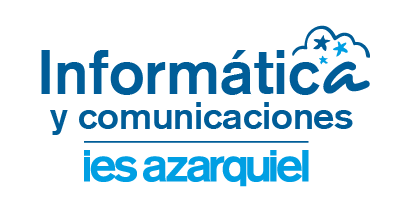

# **DIW - Diseño de Interfaces Web**

Bienvenidos al módulo de **Diseño de Interfaces Web (DIW)**, donde exploraremos los principios fundamentales para la creación de interfaces web funcionales,accesibles, usables, intuitivas y estéticamente agradables. A lo largo del curso, aprenderás a planificar, diseñar y desarrollar interfaces web que mejoren la experiencia del usuario mediante el uso adecuado de elementos visuales como el color, la tipografía y los iconos.

---

Te invito a que revises la **[Programación Didáctica](https://docs.google.com/document/d/191Lf5I5oZgAO87bs2ZUu70imJ4ceVAMC/edit?usp=sharing&ouid=107356951028877771072&rtpof=true&sd=true)** del curso, donde encontrarás el contenido completo y los objetivos que esperamos alcanzar juntos.

## **Evaluación del curso**

En este curso, la evaluación será continua y se basará tanto en tus actividades diarias como en exámenes teóricos y prácticos. A continuación te explico el proceso de evaluación:

### **1. Documentación de trabajo**
Al inicio de cada unidad, deberás crear un documento en **Google Docs** en el que registrarás las actividades propuestas. En este documento, realizarás y documentarás todas las tareas asignadas. Este documento será revisado de manera colaborativa o individual por el profesor.

**Importante:** Debes tener todas las actividades resueltas al finalizar cada unidad, ya que será un requisito para poder realizar la prueba objetiva correspondiente.

### **2. Ejercicios propuestos**
Al final de cada unidad, se te asignará un **Google Docs colaborativo** donde, en grupos, deberán resolver algunos ejercicios. Cada estudiante tendrá la oportunidad de aportar una solución a uno o varios ejercicios, y posteriormente los revisaremos y debatiremos juntos en clase, como parte de la **retroalimentación**. Este proceso no solo te ayudará a entender mejor los conceptos, sino que también será un espacio para compartir y discutir diferentes enfoques y soluciones.

### **3. Elaboración de preguntas del examen**
Una de las formas en que te prepararás para el examen teórico será creando las preguntas tú mismo. A cada estudiante, o a un grupo de estudiantes, se le asignará una parte del temario para que formulen **3 preguntas tipo test**. Estas preguntas serán revisadas y seleccionadas para la prueba objetiva final. De esta manera, no solo te prepararás al estudiar el material, sino que también tendrás una visión profunda de los temas al formular preguntas que podrían aparecer en la prueba objetiva. Esta actividad será muy útil para consolidar el aprendizaje y servirá como material preparatorio para toda la clase.

### **4. Práctica Global**
Antes de cada unidad de trabajo, llevarás a cabo una **práctica global** o **supuesto práctico**, el cual será evaluado de forma individual con una rúbrica. Este ejercicio o proyecto te ayudará a consolidar los conocimientos adquiridos durante la unidad.

### **5. Examen final**
La prueba objetiva final será realizada de una o varias unidades de trabajo:

#### Parte 1: Teoría (40% del examen final)
- Examen **online** de tipo **test**.
- Preguntas cerradas con una única respuesta correcta entre cuatro opciones, basadas en las preguntas elaboradas por los propios estudiantes.
- El examen está cronometrado, con un límite de tiempo (normalmente 30 minutos para 40 preguntas).
- Por cada **tres respuestas incorrectas**, se te descontará una respuesta correcta.
- La fórmula para calcular tu nota es:  
  **Nota final = Respuestas correctas - (Respuestas Incorrectas ÷ 3)**
  

#### Parte 2: Práctica (60% del examen final)
La segunda parte del examen consistirá en la resolución de un ejercicio práctico o proyecto basado en:

- Las actividades propuestas y resueltas durante la unidad.
- El **supuesto práctico** que realizaste previamente.

Debes completar ambas partes para poder aprobar el curso.

## **Evaluación de las Unidades de Trabajo (UT)**

A continuación se muestra la programación didáctica con los porcentajes correspondientes a cada Unidad de Trabajo (UT), así como el trimestre en el que serán evaluadas. Cada unidad tiene un **40% correspondiente al supuesto práctico** y un **60% para la prueba objetiva final**. Es importante tener en cuenta que los ejercicios propuestos y las actividades desarrolladas durante el curso servirán como base para la preparación del supuesto práctico y la Prueba Objetiva.

## **Evaluación de los Resultados de Aprendizaje (RA)**

A continuación se muestra la tabla de los **Resultados de Aprendizaje (RA)** con los porcentajes correspondientes a cada uno, así como su distribución en la **1ª Evaluación** y la **Evaluación Ordinaria**.

| **Resultados de Aprendizaje**                                                                                  | **UUTT** | **% Asignado 1ª Evaluación** | **% Asignado Evaluación Ordinaria** |
|----------------------------------------------------------------------------------------------------------------|----------|------------------------------|-------------------------------------|
| 1. Planifica la creación de una interfaz web valorando y aplicando especificaciones de diseño.                 | 1        | 10%                          | 10%                                 |
| 2. Crea interfaces Web homogéneas definiendo y aplicando estilos.                                              | 2        | 40%                          | 40%                                 |
| 3. Prepara archivos multimedia para la Web, analizando sus características y manejando herramientas específicas.| 3        |                          | 15%                                 |
| 4. Integra contenido multimedia en documentos Web valorando su aportación y seleccionando los elementos interactivos. | 4    |                          | 20%                                 |
| 5. Desarrolla interfaces Web accesibles, analizando las pautas establecidas y aplicando técnicas de verificación. | 5    |                       | 7.5%                                |
| 6. Desarrolla interfaces Web amigables, analizando y aplicando las pautas de usabilidad establecidas.           | 6        |                         |  7.5%                             |
|                                                                                                    |             | 50%        | 100% 

---

Total asignado para la 1ª Evaluación: **50%**  
Total asignado para la Evaluación Ordinaria: **100%**

## **Unidades de trabajo**

El curso está organizado en las siguientes unidades de trabajo:

### **[Unidad 1: Planificación de Interfaces Gráficas](unidad1/unidad1.md)**
En la **Unidad 1**, aprenderás sobre:
- **Elementos del diseño**: percepción visual y principios básicos.
- **Color, tipografía e iconos**: selección y uso efectivo en el diseño web.
- **Interacción Persona-Ordenador (IPO)**: cómo mejorar la comunicación entre el usuario y la interfaz.
- **Guías de estilo**: interpretación y uso de elementos clave.
- **Documentos y sitios web**: generación y maquetación.
- **Mapa de navegación y prototipos**: planificación y diseño.

### **[Unidad 2: Uso de estilos en documentos web](unidad2/unidad2.md)**
En la **Unidad 2**, aprenderás sobre:
- **Estilos en línea y clases**: cómo aplicar estilos a través de etiquetas y clases.
- **Hojas de estilo**: creación y vinculación de hojas de estilo en cascada externas.
- **Preprocesadores de estilos**: introducción a variables, mixins y funciones para optimizar el desarrollo.

### **[Unidad 3: Implantación de contenido multimedia](unidad3/unidad3.md)**
En la **Unidad 3**, aprenderás sobre:
- **Tipos de imágenes en la web**: formatos y optimización de imágenes.
- **Propiedad intelectual y licencias**: consideraciones legales y licencias de uso.
- **Audio y vídeo**: codificación, formatos y exportación/importación.
- **Animaciones**: integración de elementos multimedia interactivos.

### **[Unidad 4: Integración de contenido interactivo](unidad4/unidad4.md)**
En la **Unidad 4**, aprenderás sobre:
- **Elementos interactivos**: diseño y comportamiento.
- **Scripts interactivos**: ejecución y validación de scripts.
- **Verificación multiplataforma**: pruebas en distintos navegadores y dispositivos.

### **[Unidad 5: Diseño de webs accesibles](unidad5/unidad5.md)**
En la **Unidad 5**, aprenderás sobre:
- **Accesibilidad web**: estándares del W3C y principios de las WCAG.
- **Evaluación de conformidad**: criterios y herramientas para verificar la accesibilidad en diferentes dispositivos y navegadores.

### **[Unidad 6: Implementación de la usabilidad en la web](unidad6/unidad6.md)**
En la **Unidad 6**, aprenderás sobre:
- **Análisis de usabilidad**: identificación de objetivos y barreras del usuario.
- **Verificación de usabilidad**: pruebas en distintos navegadores y tecnologías.
- **Posicionamiento en buscadores**: mejora de la visibilidad y velocidad de navegación.

---

## **Enlaces y recursos adicionales**
- **[Guía didáctica del curso](https://docs.google.com/document/d/191Lf5I5oZgAO87bs2ZUu70imJ4ceVAMC/edit?usp=sharing&ouid=107356951028877771072&rtpof=true&sd=true)**

---

<a property="dct:title" rel="cc:attributionURL" href="https://github.com/kdeveloper7">DIW</a> by <a rel="cc:attributionURL dct:creator" property="cc:attributionName" href=https://github.com/kdeveloper7>Juan Camilo Lotero Gonzales</a> is licensed under <a href="https://creativecommons.org/licenses/by-nc-sa/4.0/?ref=chooser-v1" target="_blank" rel="license noopener noreferrer" style="display:inline-block;">CC BY-NC-SA 4.0</a>

