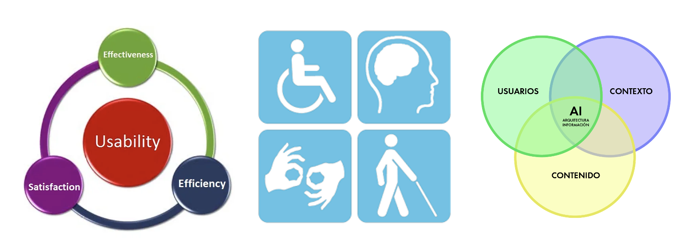

## **0. Introducción**

**Debate inicial**

- ¿Qué es una interfaz de usuario?
- ¿Dónde podemos encontrar interfaces de usuario?
- ¿En quién tenemos que pensar cuando creamos una interfaz de usuario?
- ¿Qué herramientas conoces para el diseño y programación de interfaces?
- ¿Qué lenguajes conoces para definir interfaces de usuario?
- ¿Qué es UI - UX?

## **0.1 Interfaz de usuario (UI)**

- Es el punto de interacción y comunicación humano-computadora en un dispositivo. 
- Esto puede incluir pantallas de visualización, teclados, un mouse y la apariencia de un escritorio.  
- No está limitado a aplicaciones informáticas. Una lavadora, un automóvil o un mando a distancia también son interfaces de usuario. 

Fuente: [Computer Weekly](https://www.computerweekly.com/es/definicion/Interfaz-de-usuario-UI)

**Ejemplos de interfaz de usuario**

- mouse de computadora
- control remoto
- realidad virtual
- cajeros automáticos (ATM)
- velocímetro
- pantalla táctil 
- lavavajillas
- automóvil

## **0.2 Tipos de interfaz de usuario**

Tipos de interfaz según la forma de interactuar del usuario:

- [CLI](https://es.wikipedia.org/wiki/Interfaz_de_l%C3%ADnea_de_comandos) (Command-Line Interface): interfaz de línea de comandos. Sólo representan texto. El teclado es el periférico preferido. 
- [GUI](https://es.wikipedia.org/wiki/Interfaz_gr%C3%A1fica_de_usuario) (Graphic User Interface): Permiten comunicarse con la computadora de forma rápida e intuitiva representando gráficamente los elementos de control y medida. El ratón (y el teclado) es el dispositivo periférico preferido. 
- [NUI](https://es.wikipedia.org/wiki/Interfaz_natural_de_usuario) (Natural User Interface): Pueden ser táctiles, representando gráficamente un «panel de control» o mediante reconocimiento del habla. 

Fuente: [Wikipedia](https://es.wikipedia.org/wiki/Interfaz_natural_de_usuario)

## **0.3 Experiencia de usuario (UX)**

> _“La función de los profesionales de la experiencia de usuario no es otra que hacer esta tecnología amigable, satisfactoria, fácil de usar y, por tanto, realmente útil”_
> 
> [Experiencia de usuario: Principios y métodos, Yusef Hassan Montero](https://yusef.es/Experiencia_de_Usuario.pdf)

## **0.4 UX (User Experience)**

- **UX es la manera en que el usuario percibe, siente o interactúa con un sistema o un servicio**. Se trata de la sensación del usuario cuando está en contacto e interactúa con una web, una app o un sistema.
- **UX es un grupo de disciplinas**: interacción, arquitectura de la información, animación en diseño, estilo de comunicación.
- **UX es un proceso**. No se trata de algo estático; un buen desarrollo de UX involucra una serie de fases para garantizar la calidad de un producto.

Fuente: [Strike Heredia - Domestika](https://www.domestika.org/es/blog/2125-que-es-ux)

### **Conceptos fundamentales**

- **Usabilidad**: es un atributo de calidad de un producto que se refiere sencillamente a su facilidad de uso.
- **Accesibilidad**: se refiere a la posibilidad de que pueda ser usado sin problemas por el mayor número de personas posibles, independientemente de las limitaciones propias del individuo o de las derivadas del contexto de uso.
- **Arquitectura de información**: “El arte, la ciencia y la práctica de diseñar espacios interactivos comprensibles, que ofrezcan una experiencia de uso satisfactoria facilitando el encuentro entre las necesidades de los usuarios y los contenidos y/o funcionalidades del producto”.

Fuente: [Experiencia de usuario: Principios y métodos, Yusef Hassan Montero](https://yusef.es/Experiencia_de_Usuario.pdf)

### **Diseño centrado en el usuario**

El Diseño Centrado en el Usuario o DCU (UCD, User-Centered Design) hace referencia a una visión o filosofía del diseño en la que el proceso está conducido por información acerca de la audiencia objetiva del producto.

La principal diferencia del DCU frente a otros enfoques es que su proceso no es secuencial o lineal, sino que presenta ciclos en los que iterativamente se prueba el diseño y se optimiza hasta alcanzar el nivel de calidad requerido.

Fuente: [Experiencia de usuario: Principios y métodos, Yusef Hassan Montero](https://yusef.es/Experiencia_de_Usuario.pdf)

### **Metodología Agile**

- El manifiesto Agile: [agilealliance.org](https://www.agilealliance.org/agile101/the-agile-manifesto/)
- SCRUM: [Wikipedia.org](https://es.wikipedia.org/wiki/Scrum_(desarrollo_de_software))

### **Principios del diseño**

- Clasificación
- Color
- Eficiencia
- Error humano
- Estética
- Fotografías
- Iconos
- Inteligencia colectiva
- Jerarquía visual
- Legibilidad e inteligibilidad
- Ley de Fitts
- Mapeo Natural
- Ordenación
- Relevancia
- Taxonomías
- Toma de decisiones
- Visibilidad y retroalimentación

Para más información consultar: [Experiencia de usuario: Principios y métodos, Yusef Hassan Montero](https://yusef.es/Experiencia_de_Usuario.pdf)

### **Métodos para el UX**

- Analítica Web
- Card Sorting
- Diagramas de interacción
- Diseño modular
- Encuestas y entrevistas
- Evaluación eurística
- Personajes y escenarios
- Pruebas A/B
- Pruebas con usuarios
- ROI
- Wireframes

Para más información consultar: [Experiencia de usuario: Principios y métodos, Yusef Hassan Montero](https://yusef.es/Experiencia_de_Usuario.pdf)

## **UI versus UX**

## **Sistemas de Diseño**

Un **sistema de diseño** es un conjunto de **principios, componentes, guías y herramientas** que permiten mantener la coherencia y escalabilidad en el desarrollo de productos digitales (aplicaciones, sitios web, etc.).

Se enfoca tanto en el diseño visual como en la experiencia del usuario y el código. Su objetivo es facilitar la **colaboración entre diseñadores y desarrolladores**, al tiempo que garantiza la consistencia en todo el producto.

Fuente: [designerup.co](https://designerup.co/blog/10-best-design-systems-and-how-to-learn-and-steal-from-them/)

---

# **Unidad 1: Planificación de Interfaces Gráficas**

### **Introducción**
El diseño de interfaces gráficas para la web es un proceso previo de configuración mental, que consiste en la búsqueda de una solución adecuada en cualquier campo. Este proceso implica la investigación, análisis, modelado y ajustes.

## **1.1. Elementos del Diseño**

## **Introducción**

> **DISEÑO** se define como el proceso previo de configuración mental, "pre-figuración", en la búsqueda de una solución en cualquier campo.

---

### **1.1.1 Fases del diseño**

Las fases principales del proceso de diseño son:

  

---

- Diseñar es una tarea compleja y dinámica.
- Es la integración de un conjunto de requisitos técnicos, sociales y económicos, de necesidades biológicas con efectos psicológicos y de materiales, forma, color, volumen y espacio, todo ello pensado e interrelacionado con el entorno.
- Las personas dedicadas al diseño deben comunicar las ideas y conceptos de una forma clara y directa, por medio de los elementos gráficos.

### **1.1.2 Generalidades**

!!! tip "Diseño de Interfaces Web"
    - El diseño de la página web afectará directamente la satisfacción del usuario.
    - Las primeras impresiones se obtienen del diseño visual, seguidas de la funcionalidad.
    - Se debe buscar equilibrio entre todos los elementos de la página, buscando siempre un sentido gráfico y una comunicación eficaz.
    - Se tienen que generar soluciones adecuadas a las necesidades del usuario.

### **1.1.3 Percepción Visual**

!!! info "Percepción Visual"
    La **Percepción Visual** se trata del proceso mediante el cual el cerebro capta la información en forma de luz del exterior y la transforma en una recreación propia.

---

### **Acciones relacionadas con la percepción visual**:

> **Percibir no es recibir pasivamente información visual.**

### **1.1.4 Fundamentos de la Composición**

!!! info "Componer"
    **Componer** es ordenar los elementos visuales de forma adecuada a nuestra comunicación y necesidades.

---

### **Principios de la composición:**

> **No hay nada que garantice que un diseño es adecuado, pero se pueden seguir ciertas guías de composición basadas en la percepción.**

> **La experiencia es una ayuda a la hora de empezar a diseñar. Ante la falta de experiencia, podemos visitar muchas páginas diferentes relacionadas con el trabajo que vamos a desarrollar.**

---

### **Factores importantes:**

- **Componentes psicosomáticos del sistema nervioso**: cómo el cerebro recoge la información y la interpreta.
- **Componentes culturales**: los códigos de colores no son los mismos en todas las culturas. Por ejemplo, el negro es luto en algunas culturas, mientras que en otras es el blanco.unos y en otros es el blanco. O por ejemplo, el modo en que se lee un texto, es distinto en occidente que en oriente.
- **Experiencias personales**: la experiencia personal puede influir en el modo de leer o interpretar un diseño.

### **1.1.5 Elegancia y Simplicidad**

  

    <ul>
      <li><strong>Elegancia:</strong> Elegir cuidadosamente, refinamiento.</li>
      <ul>
        <li>Selección cuidada de elementos.</li>
      </ul>

      <li><strong>Simplicidad:</strong> La capacidad de elegir los elementos mínimos y más acordes a un problema.</li>
      <ul>
        <li>Diseños simples se aprenden antes y mejor.</li>
        <li>Diseños simples se reconocen mejor y de forma más sencilla.</li>
        <li>Diseños simples tienen un impacto mayor que los complejos.</li>
        <li>Diseños simples son más "usables" que los complejos.</li>
      </ul>
    </ul>
  

  

    ELEGANCIA   Y   SIMPLICIDAD
  

  

    ESCALA,   CONTRASTE   Y   PROPORCIÓN
  

  

    ORGANIZACIÓN   Y   ESTRUCTURA   VISUAL
  

---

!!! info "Elegancia"
    **Elegancia** implica elegir cuidadosamente y refinar cada elemento para que el diseño sea estéticamente placentero y eficiente.

!!! tip "Simplicidad"
    **Simplicidad** es la clave para maximizar la efectividad de un diseño. Menos es más: los diseños simples se reconocen mejor y son más "usables" que los complejos.

### **1.1.6 Principios de Elegancia y Simplicidad**

  

    <h4><strong>PRINCIPIOS</strong></h4>
    <ul>
      <li><strong>Unidad:</strong> Los diseños más elegantes producen máxima satisfacción con mínimo número de elementos.</li>
      <li><strong>Refinamiento:</strong> El diseño se realiza mediante sucesivos refinamientos, partiendo de una interfaz más compleja y eliminando lo superfluo.</li>
      <li><strong>Fitness:</strong> Los diseños se evalúan en conjunto, junto a la capacidad para resolver el problema concreto.</li>
    </ul>
  

  

    
    
    
  

---

!!! success "Principio de Unidad"
    Los diseños más elegantes producen máxima satisfacción utilizando el mínimo número de elementos. 

!!! note "Principio de Refinamiento"
    El diseño requiere sucesivos refinamientos para eliminar lo superfluo y mejorar la eficiencia visual.

!!! quote "Principio de Fitness"
    El diseño debe resolver el problema concreto y ser evaluado en conjunto con sus objetivos.
