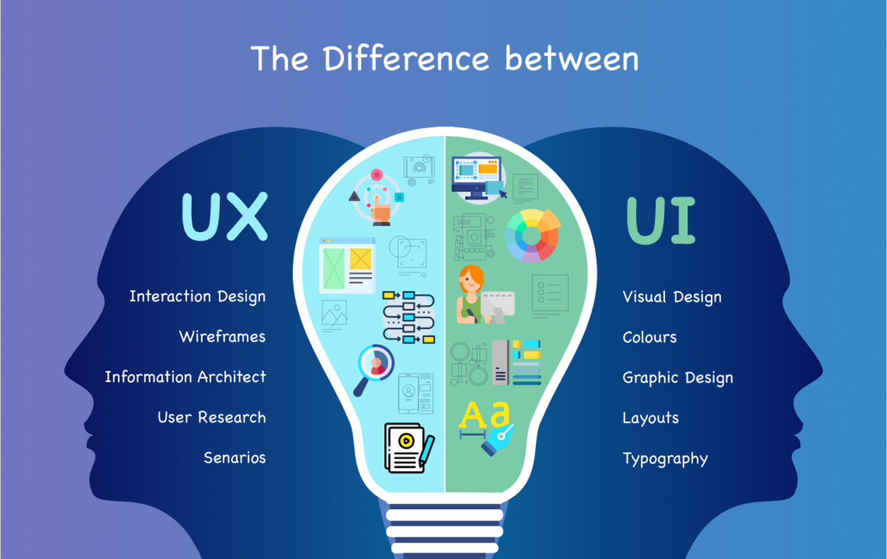

## **0. Introducción**

**Debate inicial**

- ¿Qué es una interfaz de usuario?
- ¿Dónde podemos encontrar interfaces de usuario?
- ¿En quién tenemos que pensar cuando creamos una interfaz de usuario?
- ¿Qué herramientas conoces para el diseño y programación de interfaces?
- ¿Qué lenguajes conoces para definir interfaces de usuario?
- ¿Qué es UI - UX?

## **0.1 Interfaz de usuario (UI)**

- Es el punto de interacción y comunicación humano-computadora en un dispositivo. 
- Esto puede incluir pantallas de visualización, teclados, un mouse y la apariencia de un escritorio.  
- No está limitado a aplicaciones informáticas. Una lavadora, un automóvil o un mando a distancia también son interfaces de usuario. 

Fuente: [Computer Weekly](https://www.computerweekly.com/es/definicion/Interfaz-de-usuario-UI)

**Ejemplos de interfaz de usuario**

- mouse de computadora
- control remoto
- realidad virtual
- cajeros automáticos (ATM)
- velocímetro
- pantalla táctil 
- lavavajillas
- automóvil

## **0.2 Tipos de interfaz de usuario**

Tipos de interfaz según la forma de interactuar del usuario:

- [CLI](https://es.wikipedia.org/wiki/Interfaz_de_l%C3%ADnea_de_comandos) (Command-Line Interface): interfaz de línea de comandos. Sólo representan texto. El teclado es el periférico preferido. 
- [GUI](https://es.wikipedia.org/wiki/Interfaz_gr%C3%A1fica_de_usuario) (Graphic User Interface): Permiten comunicarse con la computadora de forma rápida e intuitiva representando gráficamente los elementos de control y medida. El ratón (y el teclado) es el dispositivo periférico preferido. 
- [NUI](https://es.wikipedia.org/wiki/Interfaz_natural_de_usuario) (Natural User Interface): Pueden ser táctiles, representando gráficamente un «panel de control» o mediante reconocimiento del habla. 

Fuente: [Wikipedia](https://es.wikipedia.org/wiki/Interfaz_natural_de_usuario)

## **0.3 Experiencia de usuario (UX)**

> _“La función de los profesionales de la experiencia de usuario no es otra que hacer esta tecnología amigable, satisfactoria, fácil de usar y, por tanto, realmente útil”_
> 
> [Experiencia de usuario: Principios y métodos, Yusef Hassan Montero](https://yusef.es/Experiencia_de_Usuario.pdf)

## **0.4 UX (User Experience)**

- **UX es la manera en que el usuario percibe, siente o interactúa con un sistema o un servicio**. Se trata de la sensación del usuario cuando está en contacto e interactúa con una web, una app o un sistema.
- **UX es un grupo de disciplinas**: interacción, arquitectura de la información, animación en diseño, estilo de comunicación.
- **UX es un proceso**. No se trata de algo estático; un buen desarrollo de UX involucra una serie de fases para garantizar la calidad de un producto.

Fuente: [Strike Heredia - Domestika](https://www.domestika.org/es/blog/2125-que-es-ux)

### **Conceptos fundamentales**

- **Usabilidad**: es un atributo de calidad de un producto que se refiere sencillamente a su facilidad de uso.
- **Accesibilidad**: se refiere a la posibilidad de que pueda ser usado sin problemas por el mayor número de personas posibles, independientemente de las limitaciones propias del individuo o de las derivadas del contexto de uso.
- **Arquitectura de información**: “El arte, la ciencia y la práctica de diseñar espacios interactivos comprensibles, que ofrezcan una experiencia de uso satisfactoria facilitando el encuentro entre las necesidades de los usuarios y los contenidos y/o funcionalidades del producto”.

Fuente: [Experiencia de usuario: Principios y métodos, Yusef Hassan Montero](https://yusef.es/Experiencia_de_Usuario.pdf)

### **Diseño centrado en el usuario**

El Diseño Centrado en el Usuario o DCU (UCD, User-Centered Design) hace referencia a una visión o filosofía del diseño en la que el proceso está conducido por información acerca de la audiencia objetiva del producto.

La principal diferencia del DCU frente a otros enfoques es que su proceso no es secuencial o lineal, sino que presenta ciclos en los que iterativamente se prueba el diseño y se optimiza hasta alcanzar el nivel de calidad requerido.

Fuente: [Experiencia de usuario: Principios y métodos, Yusef Hassan Montero](https://yusef.es/Experiencia_de_Usuario.pdf)

### **Metodología Agile**

- El manifiesto Agile: [agilealliance.org](https://www.agilealliance.org/agile101/the-agile-manifesto/)
- SCRUM: [Wikipedia.org](https://es.wikipedia.org/wiki/Scrum_(desarrollo_de_software))

### **Principios del diseño**

- Clasificación
- Color
- Eficiencia
- Error humano
- Estética
- Fotografías
- Iconos
- Inteligencia colectiva
- Jerarquía visual
- Legibilidad e inteligibilidad
- Ley de Fitts
- Mapeo Natural
- Ordenación
- Relevancia
- Taxonomías
- Toma de decisiones
- Visibilidad y retroalimentación

Para más información consultar: [Experiencia de usuario: Principios y métodos, Yusef Hassan Montero](https://yusef.es/Experiencia_de_Usuario.pdf)

### **Métodos para el UX**

- Analítica Web
- Card Sorting
- Diagramas de interacción
- Diseño modular
- Encuestas y entrevistas
- Evaluación eurística
- Personajes y escenarios
- Pruebas A/B
- Pruebas con usuarios
- ROI
- Wireframes

Para más información consultar: [Experiencia de usuario: Principios y métodos, Yusef Hassan Montero](https://yusef.es/Experiencia_de_Usuario.pdf)

## **UI versus UX**

## **Sistemas de Diseño**

Un **sistema de diseño** es un conjunto de **principios, componentes, guías y herramientas** que permiten mantener la coherencia y escalabilidad en el desarrollo de productos digitales (aplicaciones, sitios web, etc.).

Se enfoca tanto en el diseño visual como en la experiencia del usuario y el código. Su objetivo es facilitar la **colaboración entre diseñadores y desarrolladores**, al tiempo que garantiza la consistencia en todo el producto.

Fuente: [designerup.co](https://designerup.co/blog/10-best-design-systems-and-how-to-learn-and-steal-from-them/)

---

# **Unidad 1: Planificación de Interfaces Gráficas**

### **Introducción**
El diseño de interfaces gráficas para la web es un proceso previo de configuración mental, que consiste en la búsqueda de una solución adecuada en cualquier campo. Este proceso implica la investigación, análisis, modelado y ajustes.

## **1.1. Elementos del Diseño**

## **1.1.1 Introducción**

> **DISEÑO** se define como el proceso previo de configuración mental, "pre-figuración", en la búsqueda de una solución en cualquier campo.

---

### **1.1.2 Fases del diseño**

Las fases principales del proceso de diseño son:

  

---

- Diseñar es una tarea compleja y dinámica.
- Es la integración de un conjunto de requisitos técnicos, sociales y económicos, de necesidades biológicas con efectos psicológicos y de materiales, forma, color, volumen y espacio, todo ello pensado e interrelacionado con el entorno.
- Las personas dedicadas al diseño deben comunicar las ideas y conceptos de una forma clara y directa, por medio de los elementos gráficos.

### **Generalidades**

!!! tip "Diseño de Interfaces Web"
    - El diseño de la página web afectará directamente la satisfacción del usuario.
    - Las primeras impresiones se obtienen del diseño visual, seguidas de la funcionalidad.
    - Se debe buscar equilibrio entre todos los elementos de la página, buscando siempre un sentido gráfico y una comunicación eficaz.
    - Se tienen que generar soluciones adecuadas a las necesidades del usuario.

### **1.1.3 Percepción Visual**

!!! info "Percepción Visual"
    La **Percepción Visual** se trata del proceso mediante el cual el cerebro capta la información en forma de luz del exterior y la transforma en una recreación propia.

---
### **Acciones relacionadas con la percepción visual**:

> **Percibir no es recibir pasivamente información visual.**

### **1.1.4 Fundamentos de la Composición**

!!! info "Componer"
    **Componer** es ordenar los elementos visuales de forma adecuada a nuestra comunicación y necesidades.

---

### **Principios de la composición:**

> **No hay nada que garantice que un diseño es adecuado, pero se pueden seguir ciertas guías de composición basadas en la percepción.**

> **La experiencia es una ayuda a la hora de empezar a diseñar. Ante la falta de experiencia, podemos visitar muchas páginas diferentes relacionadas con el trabajo que vamos a desarrollar.**

---

### **Factores importantes:**

- **Componentes psicosomáticos del sistema nervioso**: cómo el cerebro recoge la información y la interpreta.
- **Componentes culturales**: los códigos de colores no son los mismos en todas las culturas. Por ejemplo, el negro es luto en algunas culturas, mientras que en otras es el blanco.unos y en otros es el blanco. O por ejemplo, el modo en que se lee un texto, es distinto en occidente que en oriente.
- **Experiencias personales**: la experiencia personal puede influir en el modo de leer o interpretar un diseño.

## **1.1.5 Elegancia y Simplicidad**

  

    <ul>
      <li><strong>Elegancia:</strong> Elegir cuidadosamente, refinamiento.</li>
      <ul>
        <li>Selección cuidada de elementos.</li>
      </ul>

      <li><strong>Simplicidad:</strong> La capacidad de elegir los elementos mínimos y más acordes a un problema.</li>
      <ul>
        <li>Diseños simples se aprenden antes y mejor.</li>
        <li>Diseños simples se reconocen mejor y de forma más sencilla.</li>
        <li>Diseños simples tienen un impacto mayor que los complejos.</li>
        <li>Diseños simples son más "usables" que los complejos.</li>
      </ul>
    </ul>
  

  

    ELEGANCIA   Y   SIMPLICIDAD
  

  

    ESCALA,   CONTRASTE   Y   PROPORCIÓN
  

  

    ORGANIZACIÓN   Y   ESTRUCTURA   VISUAL
  

---

!!! info "Elegancia"
    **Elegancia** implica elegir cuidadosamente y refinar cada elemento para que el diseño sea estéticamente placentero y eficiente.

!!! tip "Simplicidad"
    **Simplicidad** es la clave para maximizar la efectividad de un diseño. Menos es más: los diseños simples se reconocen mejor y son más "usables" que los complejos.

### **1.1.5.1 Principios de Elegancia y Simplicidad**

  

    <h4><strong>PRINCIPIOS</strong></h4>
    <ul>
      <li><strong>Unidad:</strong> Los diseños más elegantes producen máxima satisfacción con mínimo número de elementos.</li>
      <li><strong>Refinamiento:</strong> El diseño se realiza mediante sucesivos refinamientos, partiendo de una interfaz más compleja y eliminando lo superfluo.</li>
      <li><strong>Fitness:</strong> Los diseños se evalúan en conjunto, junto a la capacidad para resolver el problema concreto.</li>
    </ul>
  

  

    
    
    
  

---

!!! success "Principio de Unidad"
    Los diseños más elegantes producen máxima satisfacción utilizando el mínimo número de elementos. 

!!! note "Principio de Refinamiento"
    El diseño requiere sucesivos refinamientos para eliminar lo superfluo y mejorar la eficiencia visual.

!!! quote "Principio de Fitness"
    El diseño debe resolver el problema concreto y ser evaluado en conjunto con sus objetivos.

### **1.1.5.2 Errores Comunes en el Diseño**

!!! warning "Errores Comunes en el Diseño"
    - **Ruido visual**: Gran cantidad de información puede saturar al usuario.
    - **Interferencia entre elementos**: Los elementos visuales pueden competir entre sí, dificultando la claridad del mensaje.
    - **Estructuras complejas visuales**: Diseños excesivamente complejos son difíciles de entender y navegar.
    - **Reelaborar lo obvio**: Evitar redundancias o pasos innecesarios para los usuarios avanzados.
    - **Detalles excesivos**: Aportar demasiados detalles puede distraer al usuario y sobrecargar el diseño.

---

  

  <a href="https://www.arngren.net/" target="_blank">
    
    
Este es un ejemplo mítico de un sitio web con muchos errores visuales.

    </a>
  

!!! danger "Catástrofes en Interfaces Web"
    A lo largo de la historia, algunos sitios web se han hecho famosos por sus **errores visuales** y problemas de usabilidad. Aquí tienes algunos ejemplos míticos de catástrofes en interfaces web:

    - [Cine Las Vías (hasta 2018)](https://web.archive.org/web/20180701000000*/http://www.cinelasvias.com)
    - [Arngren](https://www.arngren.net/)
    - [Gates and Fences](http://www.gatesnfences.com/)
    - [Yale Art](http://art.yale.edu)
    - [Ling's Cars](https://www.lingscars.com/)

    > Estos ejemplos destacan lo que **NO** se debe hacer en el diseño de interfaces web. Pueden servir como recordatorio de los peligros de no cuidar la estética, la funcionalidad y la experiencia de usuario.

### **1.1.5.3 Técnicas de Diseño**

!!! info "Técnicas de Diseño"
    A la hora de diseñar interfaces web, es fundamental tener en cuenta las siguientes técnicas para lograr un diseño equilibrado y efectivo.

---

### **1.1.5.4 Reducción del diseño a lo esencial**
- Determinar las cualidades principales.
- Examinar cada elemento diseñado y preguntarse si es necesario.
- Tratar de eliminar un elemento y ver qué pasa.

### **1.1.5.5 Regularización de los elementos**
- Usar los mismos elementos para las mismas funciones.
- Usar formas simples.
- Limitar la tipología del texto.

### **1.1.5.5 Combinar elementos para el máximo aprovechamiento**
- Buscar elementos que solapen funciones.
- Combinar elementos redundantes en uno solo.

---

  

    
    
Ejemplo de un diseño web simple y equilibrado.

  

  

    
    
Ejemplo de un diseño web sobrecargado y con ruido visual.

  

## **1.1.6 Escala, Contraste y Proporción**

!!! note "Principios de Escala, Contraste y Proporción"
    - **Escala:** Relación entre el tamaño de los elementos en un diseño.
    - **Contraste:** Diferencias notables entre formas y dimensiones de los elementos (forma, color, tamaño, textura, posición, orientación, movimiento).
    - **Proporción:** Balance y armonía entre la relación de los elementos para lograr un diseño cohesivo.

  

    <h4><strong>PRINCIPIOS</strong></h4>
    <ul>
      <li><strong>Claridad:</strong> Intencionalidad para proporcionar organización clara entre los elementos visuales.</li>
      <li><strong>Armonía:</strong> Buena organización frente a diferentes dispositivos y tamaños de pantalla.</li>
    </ul>
  

  

    
    
Ejemplo de escala, contraste y proporción en un diseño responsive.

  

!!! tip "Enlaces recomendados"
    - [Guía sobre Escala en Diseño](https://www.silocreativo.com/creando-escala-tipografica-diseno-web/)
    - [Ejemplos de Contraste Visual](https://addaw.org/es/blog/interes-general/Los-mejores-analizadores-de-contraste-de-color)

### **1.1.6.1 Errores Comunes**

!!! warning "Errores comunes en diseño de escala, contraste y proporción"
    - **Contraste insuficiente** o diseños muy complejos que confunden al usuario.
    - **Contraste excesivo** que genera tensión visual.
    - **Interferencia visual**: Dificultad en la comunicación debido al mal uso de colores y elementos.
    - **Tensión espacial**: Poco espacio entre elementos, lo cual impide que el ojo pueda recorrer correctamente el diseño.
    - **Sobreextensión**: Espacios excesivos entre elementos que también dificultan la navegación visual.
    - **Dimensiones no proporcionadas**, lo cual rompe con la armonía y claridad visual del diseño.

  

    
    
Ejemplo de menú con problemas de contraste.

  

  

    
    
Ejemplo de una página con sobrecarga visual.

  

### **1.1.6.2 Técncias de Diseño**
 

!!! tip "Técnicas clave para manejar la escala, contraste y proporción"
    - **Integración por tamaño**: Hacer distinciones visuales claras utilizando el tamaño de los elementos.
    - **Establecer regiones**: Diseñar distintas regiones visuales variando el tamaño de los elementos dentro de cada área, comparándolas entre sí, pero manteniendo consistencia dentro de la misma región.

  

    
    
Ejemplo de uso de escala y proporción en la página de Apple Watch.

  

  

## **1.1.7 Organización y Estructura Visual**

!!! info "Principios de Organización Visual"
    - **Agrupar elementos similares**: Centrar la atención sobre los elementos más simples y relacionados.
    - **Relación**: Usar las relaciones entre elementos para agrupar y organizar visualmente.
    - **Balance**: La visualización debe ser agradable, las partes de una ventana se deben equilibrar (como una balanza).

  

    <a href="https://www.frescco.es/" target="_blank">
    
    
Ejemplo de diseño agrupado y organizado visualmente

  

  

    <a href="https://www.frescco.es/" target="_blank">
    
    
Interfaz móvil con equilibrio visual y relación de elementos

  

## **1.1.13 Errores Más Comunes en la Organización y Estructura Visual**

!!! warning "Errores Más Comunes en la Organización y Estructura Visual"
    - **Mala organización**: Falta de estructura clara en el diseño.
    - **Simetrías conflictivas**: Simetrías mal aplicadas que generan confusión visual.
    - **Relaciones internas ambiguas**: Organización de etiquetas y controles no clara.
    - **Alineación de etiquetas y no de controles**: Mal alineamiento de elementos en el diseño.
    - **Alinear una parte y no el todo**: Falta de coherencia en la alineación de todo el conjunto visual.
    - **Distribución y agrupamiento inadecuado**: Agrupación poco intuitiva de los elementos.
    - **Excesiva densidad informativa**: Demasiada información en un espacio reducido, lo cual satura al usuario.

  

    <a href="https://www.azuqueca.es/" target="_blank">
      
      
Ejemplo de un sitio web con problemas de organización y distribución visual.

    </a>
  

## **1.1.14 Técnicas de Diseño para la Organización y Estructura Visual**

!!! info "Técnicas de Diseño"
    Estas son las principales técnicas a tener en cuenta para organizar y estructurar visualmente una interfaz de forma efectiva:

    - **Una cuidada planificación**: El diseño debe ser planificado cuidadosamente para asegurar un equilibrio visual.
    - **Simetría para el balance**:
        - Identificar ejes de simetría y usar simetría vertical.
        - Centrar la información en el eje y balancearla.
    - **Alineación**:
        - Buscar bordes y alinearlos tanto de la página como de las áreas y controles.
        - Si algo no se puede alinear, hacerlo proporcional a la pantalla y centrarlo.
    - **Ajuste óptico**: Determinar el tamaño que se considerará normal y usarlo como base.
    - **Espacio negativo**:
        - Organizar en trozos de información.
        - Añadir espacio en donde sea necesario para resaltar.

  

    
    
Ejemplo de diseño organizado con simetría y alineación efectiva.

  

## **Actividad de Clase 1.1**

!!! task "Actividad"
    Realizar un estudio sobre el **diseño visual** de una página web.

    Para ello, tendréis que elegir una página web y analizarla tomando como base los elementos estudiados:
    
    - **Elegancia y simplicidad**: ¿La página es visualmente atractiva y sencilla de navegar?
    - **Escala, contraste y proporción**: ¿Los elementos están bien proporcionados y se usan contrastes adecuados?
    - **Organización y estructura visual**: ¿Los elementos están bien organizados y alineados de manera coherente?

    ### Instrucciones:
    - Realizad un análisis visual de la página seleccionada y comparadla con las buenas prácticas vistas en clase.
    - Preparad una **exposición** con vuestras conclusiones para presentar al resto de la clase.

!!! example "Ejemplo de presentación"
    1. Elige una página web relevante.
    2. Evalúa su diseño visual utilizando los principios mencionados.
    3. Presenta los hallazgos destacando las fortalezas y áreas de mejora de la página.

# **1.2. Color, Tipografía e Iconos**

## **Introducción**

!!! info "Introducción"
    Al margen de que un diseño sea más o menos atractivo o artístico, quien diseña y desarrolla una **interfaz de usuario** debe tener en cuenta una serie de normas para hacer que esa interfaz sea más fácil de utilizar por el usuario.

  

    COLOR
  

  

    TIPOGRAFÍA
  

  

    ICONOS
  

---

!!! note "Elementos Primordiales del Diseño"
    - El **color**, la **tipografía** y los **iconos** son elementos esenciales en el diseño visual. Estos contribuyen a la identidad y funcionalidad de una interfaz.

!!! tip "Infinitas Posibilidades"
    - Las combinaciones entre **color**, **tipografía** e **iconos** son infinitas. Sin embargo, es esencial buscar un equilibrio que permita una comunicación clara y efectiva.

---

### **1.2.1 Color**

!!! quote "Importancia del Color"
    El color es una de las herramientas más potentes en el diseño, ya que influye en la percepción y las emociones del usuario. Es fundamental elegir paletas de colores que transmitan el mensaje adecuado y faciliten la navegación.

!!! note "¿Qué es el color?"
    El **COLOR** es una propiedad que tienen los objetos y que podemos percibir gracias a la luz.

  

    El COLOR es una propiedad que tienen los objetos y que podemos percibir gracias a la luz.
  

  

    
    
Espectro visible al ojo humano

  

---

### **1.2.2 Propiedades del Color**

Las propiedades del color son aquellos atributos que cambian y hacen único a cada color. Son tres: el tono, la saturación y la luminosidad.

---

- **Tono o matiz (Hue):** Es la propiedad que diferencia un color de otro y por la cual designamos los nombres de los colores. Los tres matices primarios son los clores aditivos : verde, rojo y azul; el resto de los colores se obtienen
                          mezclando estos tres.

!!! note "Colores Complementarios"
    El **matiz** permite definir dos colores como complementarios cuando uno está frente al otro en el círculo cromático

  

    
  

- **Saturación (Saturation):** Es la intensidad o pureza de un color, y varía según la cantidad de luz que tenga, por lo tanto, queda condicionado por el nivel de gris presente en un color. Cuanto mayor sea el nivel de gris, menos saturado será un color , y será menos intenso.
  

    
  

- **Luminosidad (lightnesso) o brillo (Brightness):** Es la cantidad de luz que refleja un color, es decir, cómo es de oscuro o de claro.
  

    
  

---

  

    
  

  
  

    
  

!!! note "Tipos de Colores"
    El **matiz** permite definir dos colores como complementarios cuando uno está frente al otro en el círculo cromático

    

    
  

!!! note "Emociones asociadas a los colores"
Las siguientes imágenes reflejan las emociones y actitudes mentales asociadas a los colores, además, algunas las marcas corporativas que los han implementado.

  

  

    
  

  
  

    
  

### **1.2.3 Color en Informática**

- **Usan dos tipos de colores según el dispositivo:**
  

    

      
      
<strong>RGB(RedGreenBlue)</strong>para dispositivos que emiten luz.

    

  
    

      
      
<strong>CMYK (CyanYellowMagentaBlack)</strong> para dispositivos de impresión.

    

---

!!! info "Color en Dispositivos"
    En informática, se utilizan dos tipos de colores según el dispositivo que estemos usando:

    - **RGB (Red, Green, Blue)** para dispositivos que emiten luz.
    - **CMYK (Cyan, Yellow, Magenta, Black)** para dispositivos de impresión.

  

    
<strong>Esquema de color RGB:</strong>

    
<strong>Rojo:</strong> FF0000

    
<strong>Verde:</strong> 00FF00

    
<strong>Azul:</strong> 0000FF

    
<strong>Blanco:</strong> FFFFFF

    
<strong>Negro:</strong> 000000

    
<strong>Gris:</strong> CCCCCC

  

---

### **1.2.4 Herramienta interactiva: Cambia el color con CSS en tiempo real**

Inserta los valores de color en RGB y observa cómo cambia el color en tiempo real. Además, ahora puedes ver el código hexadecimal del color seleccionado.

<!DOCTYPE html>
<html lang="es">
<head>
  <meta charset="UTF-8">
  <meta name="viewport" content="width=device-width, initial-scale=1.0">
  <title>Cambiar Colores en Tiempo Real</title>
  
</head>
<body>

  <h2>Cambia el color con RGB:</h2>
  
  

    <label for="red">Rojo (R):</label>
    <input type="range" id="red" name="red" min="0" max="255" value="255">
    

    #FF0000
  

  

    <label for="green">Verde (G):</label>
    <input type="range" id="green" name="green" min="0" max="255" value="0">
    

    #00FF00
  

  

    <label for="blue">Azul (B):</label>
    <input type="range" id="blue" name="blue" min="0" max="255" value="0">
    

    #0000FF
  

  

  
Color Hexadecimal Completo: #FF0000

  

</body>
</html>

!!! note "Ejemplo de RGB"
    Comprueba en la herramienta que para formar el color amarillo se debe realizar la combinación del ejemplo

    

    
  

### **1.2.5 Paleta de colores**

!!! note "Paleta de Color"
    Se define **PALETA DE COLOR** como el conjunto de colores que usamos en el desarrollo.

!!! tip "Importancia de la Paleta de Color"
    Se debe elegir una paleta de colores antes de comenzar a diseñar y debe estar relacionada con el proyecto que vamos a crear.

---

### **1.2.6 Reglas para Crear tu Paleta de Colores**

!!! tip "Reglas Básicas para una Paleta de Colores"
    Sigue estas 3 reglas para crear una paleta de colores equilibrada y visualmente atractiva.

  

    

      1
    

    
Combina el tono total de la infografía

  

  

    

      2
    

    
Elige colores que funcionen bien juntos

  

  

    

      3
    

    
Elige 2 o 3 colores como máximo

  

!!! tip "Sugerencias adicionales"
    - No sobrecargues tu diseño con demasiados colores.
    - Asegúrate de que los colores que elijas mantengan una armonía y balance en toda la interfaz.

### **1. Combina el tono total de la infografía**: Elige colores que se adapten a la marca.

Ejemplos: Si la infografía es sobre una película de terror, elige colores oscuros y sombras. Si hablas sobre barcos, entonces selecciona un matiz azul y juega con el tinte, el tono, y la sombra. Si es una infografía de negocios, no utilices colores brillantes y divertidos como el amarillo o el naranja.

  

---

!!! example "Ejemplo de Coca-Cola"
    El sitio web de Coca-Cola es un buen ejemplo de cómo se utilizan los colores de la marca para generar una sensación de cohesión visual.
    - Los colores rojo y blanco dominan toda la interfaz.
    - Se usa un color neutro para destacar la marca sin saturar al usuario.

### **2. Elige colores que funcionen bien juntos**

El primer paso es entender y visualizar el **círculo cromático**. Este gráfico muestra los distintos matices y sus tonos, tintes, y sombras, y cómo se relacionan entre ellos.

  

  

    
    
Paleta de colores que funcionan bien juntos.

  

  

    
    
Paleta de colores que no funcionan bien juntos.

  

---

!!! tip "Herramienta útil"
    Utiliza la herramienta [Adobe Color](https://color.adobe.com) para crear y visualizar paletas de colores que funcionen bien en conjunto para tu proyecto.

**Monocromático.** La primera idea para seleccionar colores que funcionen bien juntos es seleccionar una paleta monocromática. Esto es trabajar con un matiz, y la variación de tintes, tonos, y sombras.

  

  

    

    

    

    

    
Paleta monocromática de tonos rojos

  

  

    

    

    

    

    
Paleta monocromática de tonos azul claro

  

  

    

    

    

    

    
Paleta monocromática de tonos rosados

  

  

    

    

    

    

    
Paleta monocromática de tonos verdes

  

### **Complementarios:**  
Los colores que se encuentran en extremos opuestos del círculo cromático se consideran complementarios. Al combinar estos dos colores, puedes expresar contraste e interés. Son difíciles de usar en grandes cantidades, pero por su contraste son muy buenos para resaltar algo, como un llamado de atención.

  
  

    
  

  

    

      

      #26469E
    

    

      

      #7096FF
    

    

      

      #507EB
    

    

      

      #A37F21
    

    

      

      #EBBF50
    

    
Ejemplo de paleta de colores complementarios

  

---

### **Análogos:**  
Los colores que se encuentran al lado en el círculo cromático son agradables juntos. Son la combinación perfecta, ya que son geniales para cualquier uso, incluso para resaltar y contrastar un elemento específico sin demasiada interrupción.

  
  

    
  

  

    

      

      #EBF61E
    

    

      

      #D4C419
    

    

      

      #EBC728
    

    

      

      #D49F19
    

    

      

      #F6A31E
    

    
Ejemplo de paleta de colores análogos

  

### **Triada:**  
Utiliza tres colores distintos que se encuentran a la misma distancia en el círculo cromático. Esta estrategia crea combinaciones vibrantes y atractivas, pero que son difíciles de implementar a la perfección. Para usar una tríada de forma exitosa, los colores deben estar equilibrados, y se debería usar uno dominante y los otros dos para acentuar.

  
  

    
  

  

    

      

      #9E9424
    

    

      

      #3BC7EB
    

    

      

      #EBB6D4
    

    

      

      #EB3676
    

    

      

      #9E2C54
    

    
Ejemplo de paleta de colores en triada

  

### **3. Elige 2 o 3 colores**

- Debe haber un color predominante que deberías usar en una proporción de un **60%**. Lo podrías utilizar en la cabecera, como fondo en las diferentes secciones, las landing pages, etc.
- Otro secundario que utilizarías en un **30%** más o menos (fondos de formularios, cajas de llamada a la acción, enlaces, etc.).
- Por último deberías dejar un color, el más llamativo o potente, para el **10%** restante que generalmente utilizarás para botones o elementos de alto valor estratégico.

  

    60%
  

  
  

    30%
  

  
  

    10%
  

## **Actividad de clase 2**

!!! task "Tarea 1: Crea Paletas de Colores"
    Usando **Figma** como herramienta principal, realiza las siguientes paletas de colores y guárdalas en un documento de Word.
    <ul>
        <li>Monocromática</li>
        <li>Complementaria</li>
        <li>Análoga</li>
        <li>Triada</li>
    </ul>

    <h4>Instrucciones:</h4>
    <ol>
        <li>Crea las paletas de colores directamente en <strong>Figma</strong>.</li>
        <li>Crea las dos primeras paletas de colores y guárdalas como estilos locales, las otras dos como librería de variables.</li>
        <li>Exporta las paletas como archivo pdf.</li>
        <li>Comparte el enlace de tu proyecto figma a cualquiera que tenga el enlace, únicamente como visualizador y no como editor.</li>
        <li>Tanto el enlace, el pdf y las capturas  debes registrarlas en un documento de google docs.</li>
    </ol>

---

!!! info "Consejo"
    Recuerda utilizar los conocimientos adquiridos sobre la teoría del color y el círculo cromático como el de [Adobe](https://color.adobe.com/es/create/color-wheel) para crear paletas que funcionen bien juntas. Figma es ideal para ajustar colores, y te permitirá visualizar la armonía entre los tonos.

---

!!! task "Tarea 2: Crea una paleta de colores a partir de una imagen"
    Elige una imagen y genera una paleta de colores a partir de ella usando las herramientas de Figma. Puedes usar la opción de **"Eyedropper" (cuentagotas)** en Figma para extraer los colores exactos de la imagen.

    <h4>Instrucciones:</h4>
    <ol>
      <li>Sube una imagen en Figma.</li>
      <li>Utiliza el **cuentagotas** para extraer 3 a 5 colores principales de la imagen.</li>
      <li>En un frame llamado colores imagen crea la paleta de coloresy guárdalos en una librería.</li>
      
    </ol>

---

# **1.2. Color, Tipografía, Iconos**

## **Tipografía**

!!! info "Definición de Tipografía"
    La **TIPOGRAFÍA** es el tipo de fuente que se utiliza en un diseño de interfaces.

  

    La TIPOGRAFÍA es el tipo de fuente que se utiliza en un diseño de interfaces
  

  

    
    
Las letras pueden variar mucho según el tipo, tanto en la forma, el grosor como en los remates que tiene cada una de ellas.

  

!!! tip "Variedad en las Fuentes"
    Las letras pueden variar mucho según el tipo, tanto en la forma, el grosor como en los remates que tiene cada una de ellas.

!!! tip "Ejemplo de Fuentes"
    Figma también es excelente para visualizar combinaciones de fuentes. Recuerda elegir **una fuente para los títulos** y **otra para el texto**. Algunas combinaciones comunes son:
    - Títulos: **Roboto Bold**, Texto: **Roboto Regular**
    - Títulos: **Montserrat Bold**, Texto: **Open Sans Regular**

## **1.2. Tipografía**

La infinidad de tipos existentes pueden agruparse en distintas familias según varios criterios:

### **Serif**: Fuentes cuyos caracteres tienen un adorno en los remates

  Garamond
  Times New Roman
  Courier

### **Sans-serif** (sin serif): Fuentes que no tienen remates.

  Arial
  Verdana
  Calibri

### **Script**: Fuentes que imitan la escritura manual. Su legibilidad es escasa.

  Edwardian Script
  French Script
  Segoe Script

### **Decorativa**: Estilo informal y creada con fines muy específicos.

  Candy
  Circus
  Nature

## **Fuentes Web**

- Es posible utilizar en la web cualquier tipo de fuente siempre que se ponga a disposición de los navegadores los ficheros con las definiciones de las mismas. Con el objeto de que funcionen correctamente en cualquier cliente, se suelen incluir varios ficheros, de tal forma que se cubren todas las variedades del sistema.

### **Repositorios de fuentes**:
- [https://www.google.com/fonts](https://www.google.com/fonts)
- [https://www.dafont.com](https://www.dafont.com)

!!! task "Tarea 3: Selección de fuentes"
    - Busca 2 fuentes que utilizarías en tu página web: **una para los títulos (lleva a cabo una jerarquía de títulos H1 hasta H3, en el mismo orden descendente bold, semibold ) y otra para el texto de párrafo en regular**.
    - Añádelas al documento de Word que estás creando con las paletas de colores.

    - **Instrucciones**:
    - **1. Elige fuentes directamente en Figma o busca en sitios como Google Fonts.**
    - **2. Inserta ejemplos de las fuentes en tu documento, explicando por qué elegiste cada una.**
    - **3. Ten en cuenta que es recomendable usar tamaños de fuente que sean múltiplos de 4, para el H1 usa 48px para el H1 y disminúyelo de forma proporcional.**
    - **4. Crea estilos para las fuentes en Figma, esto ayudará a familiarizarte con los sistemas de diseño.**

!!! success "Objetivo"
    El objetivo de esta actividad es que practiques el uso de herramientas como **Figma** para desarrollar paletas de colores efectivas y seleccionar fuentes adecuadas para tu proyecto web.

# **1.2. Color, Tipografía, Iconos**
## **Iconos**

!!! info "Definición de Icono"
    Un **icono** es un signo que mantiene una relación de semejanza con el objeto representado.

  

    Representación:   Es una forma representativa de algo del mundo real.
  

  
  

    Significado:   El mensaje transmitido por el icono genera una imagen conceptual.
  

  
  

    Función:   Logra atraer la atención del usuario y transmite el mensaje rápidamente.
  

  <i class="fas fa-home" style="color: #f28c28;"></i>
  <i class="fas fa-shopping-cart" style="color: #f28c28;"></i>
  <i class="fas fa-envelope" style="color: #f28c28;"></i>
  <i class="fas fa-search" style="color: #f28c28;"></i>

## **Iconos**

> **Importancia de los Iconos**
> 
> La elección de los iconos es crucial en el diseño de interfaces, ya que deben ser entendidos fácilmente por el usuario.
> 
> - **Elección adecuada de iconos**: Si un usuario no es capaz de entender el significado de un icono a primera vista, no habremos logrado el objetivo de facilitar la navegación.
> - **Usar iconos familiares**: Utiliza iconos a los que los usuarios ya están acostumbrados para evitar confusiones.
> - **Evitar iconos sin significado**: No uses iconos solo para adornar la página si no aportan un valor significativo.

---

### **Ejemplos de iconos comunes**

-  Página de inicio
-  Carrito de compras
-  Correo
-  Buscar

!!! tip "Iconos en Figma"
    En **Figma** se puede utilizar el plugin de Iconify para agregar íconos a nuestro sistema de diseño o se puede utilizar la tipografía **Font Awesome Free o Brands 5, tanto en regular como en solid** y utilizar la sintaxis que está en este [enlace](https://fontawesome.com/v5/search) para agregar íconos .

## **1.2. Color, Tipografía, Iconos**

## **Iconos**

### Reglas de estilo

- Usar los estándares existentes (lupa para buscar, etc.)
- Crear iconos reconocibles fácilmente por su significado.
- Dar profundidad a los diseños para mejorar la percepción.
- Ser consistente en todo el proyecto.
- Tener en cuenta la significación entre culturas.
- Crear varias familias de iconos y hacer pruebas con usuarios.
- No usarlos en funciones críticas.

---

### Ejemplos de iconos

  
  
  
  
  

  
  
 
  
  
  

---

### Consideraciones finales

Es importante seguir estas reglas para asegurar una buena experiencia de usuario con iconos claros y consistentes a lo largo del proyecto.
### Fuentes Web

- En los siguientes enlaces podrás descargar iconos bastante elaborados, algunos de los cuales son gratuitos.
    - [http://www.webiconset.com](http://www.webiconset.com)
    - [https://www.flaticon.es](https://www.flaticon.es)

- Herramienta para crear iconos:
    - [http://www.xiconeditor.com](http://www.xiconeditor.com)

- Herramienta para utilizar iconos ya creados en tu web:
    - [https://fontawesome.com](https://fontawesome.com)

# **1.3. Interacción Persona - Ordenador (IPO)**

!!! note "Definición de IPO"
    La **IPO (Interacción Persona-Ordenador)** es la disciplina que estudia el intercambio de información entre las personas y los ordenadores. Cuando hay una buena comunicación entre el usuario y el ordenador el intercambio de información es más eficiente, se reducen los errores y aumenta la satisfacción del usuario.

- Hoy en día, la mayor parte de los sistemas informáticos son sistemas interactivos y su éxito o fracaso depende, en gran medida, de la interfaz persona-ordenador. Por este motivo, la interfaz tiene que estar diseñada pensando en las necesidades del usuario.
  
- Debemos tener en cuenta que cada día aumenta el número de personas que utilizan el ordenador, que estas personas se enfrentan a la interacción con el ordenador con diferentes grados de preparación y con distintas expectativas.

# **1.4 Sistemas de Diseño**

Un **sistema de diseño** es un conjunto de herramientas, principios y componentes reutilizables que permiten diseñar y desarrollar productos digitales de forma coherente y escalable. Estos sistemas aseguran que tanto el diseño visual como la experiencia del usuario y el código se mantengan alineados.

!!! info "Relación entre Guías de Estilo y Sistemas de Diseño"
    Las **guías de estilo** forman parte de los **sistemas de diseño**, pero estos últimos abarcan mucho más que solo aspectos visuales. Un sistema de diseño también se ocupa de la funcionalidad, interacción y comportamiento de los componentes dentro del diseño digital.

## **1.4.1 Elementos Clave de un Sistema de Diseño**
- **Componentes reutilizables**: Botones, formularios, menús y otros elementos de la interfaz que se utilizan repetidamente para garantizar consistencia visual y funcional.
- **Guías de estilo**: Describen el uso correcto de tipografías, colores, iconografía, espaciados y otros elementos visuales.
- **Tokens de diseño**: Variables que definen los colores, fuentes, tamaños y espaciados en la interfaz. Permiten cambios globales fáciles en el sistema.
- **Documentación**: Asegura que los equipos sepan cómo implementar y utilizar los componentes y patrones de diseño.

## **1.4.2 Diferencias entre Sistemas de Diseño y Guías de Estilo**
La **guía de estilo** se enfoca en los aspectos visuales (colores, fuentes, iconografía), mientras que el **sistema de diseño** es más amplio e incluye no solo la estética, sino también la funcionalidad y la interacción entre los componentes.

> Fuente: [Design Systems vs Style Guides](https://www.nngroup.com/articles/design-systems-vs-style-guides/)

!!! note "Sistema de Diseño"
    El **sistema de Diseño** permite definir un conjunto mayor de información que la guía de estilos

    

    
    

    
    

## **1.4.3 Herramientas para Crear Sistemas de Diseño**
- **Figma**: Plataforma colaborativa para el diseño de interfaces.
- **Zeplin**: Herramienta que permite compartir y generar guías de estilo automáticamente desde los diseños.
- **Storybook**: Herramienta para desarrollar componentes UI de manera aislada y documentar el sistema de diseño.

# **1.5 Guías de Estilo**

!!! note "Las Guías de Estilo dentro del Sistema de Diseño"
    Una **guía de estilo** es un conjunto de directrices visuales que forman parte de un sistema de diseño. Estas guías definen cómo debe ser el uso de elementos como tipografías, colores, espaciados y otros componentes visuales para garantizar una coherencia en todo el diseño.

## **1.5.1 Desarrollo de una Guía de Estilo**
Los elementos principales para desarrollar una **guía de estilo** son:

  - **Marca**: Estudiar la identidad visual de la empresa o el proyecto.
  - **Tipografía**: Decidir qué tipografías se utilizarán (1 o 2 fuentes).
  - **Colores**: Seleccionar una paleta de colores consistente (2 o 3 colores).
  - **Iconos**: Seleccionar un set de iconos coherente para toda la web.
  - **Tono**: Definir el lenguaje que se utilizará para dirigirse al usuario.
  - **Imágenes**: Seleccionar imágenes que aporten información y coherencia visual.
  - **Controles de Formularios**: Definir el estilo de botones, cajas de texto y otros elementos interactivos.
  - **Elementos de Interfaz**: Definir estilos para listas, tablas, paneles, menús, etc.

# Práctica 1.1: Creación de un Sistema de Diseño y Prototipo en Figma

> Diseño de Interfaces Web. 

**Objetivo**: Los alumnos deberán crear un sistema de diseño completo en Figma que incluya una paleta de colores, tipografías, iconos, componentes y variables. Además, diseñarán un prototipo de al menos dos páginas conectadas por un botón de navegación. Todos los elementos del prototipo deben estar vinculados a las variables del sistema de diseño.

La temática será sobre una web de una casa rural, en las montañas de los alpes suizos que alquila por días su estancia a turistas.

## Instrucciones:

1. **Sistema de Diseño**
   - Crea un Sistema de Diseño en Figma que incluya los siguientes elementos:
     - **Paleta de colores**: Define al menos tres colores principales (primario, secundario, y acento). Estos deben estar declarados como variables globales para que puedan ser utilizados en todo el diseño.
     - **Tipografía**: Selecciona dos tipografías para usar en tu diseño (una para encabezados y otra para textos de párrafo). Establece el tamaño, peso, y estilo de la tipografía, y utiliza variables para gestionar estas propiedades.
     - **Iconos**:
       - Elige un conjunto de iconos consistentes y apropiados para tu diseño (pueden ser de una librería externa o creados por ti).
       - Los iconos deben estar correctamente integrados como parte de tu sistema de diseño, utilizando variables para tamaños y colores.
       - Crea al menos un componente que combine iconos con texto o botones.
     - **Componentes**:
       - Crea al menos dos componentes reutilizables (por ejemplo: un botón y un campo de entrada). Estos componentes deben heredar las variables de color, tipografía e iconos que has definido.
       - Asegúrate de que los estados del botón (normal, hover, clicado) también se gestionen a través de variables.
     - **Grid y Espaciado**: Establece una rejilla (grid) y margenes/espaciado para tu sistema. Declara variables para definir el espaciado entre elementos, tanto en el eje vertical como horizontal.

2. **Prototipo en Figma**
   - Diseña **dos páginas** en Figma que estarán conectadas entre sí a través de la navegación de un botón.
    - **Página 0**: Diseña una página con un frame de portada del proyecto.
     - **Página 1**: Diseña una página de bienvenida o una pantalla principal (por ejemplo: una landing page o dashboard).
     - **Página 2**: Crea una segunda página que se pueda acceder desde la primera. Esta página puede ser una página de información adicional, un formulario, etc.
   - **Interacción**: Añade una interacción en el botón de la primera página para que, al hacer clic, navegue a la segunda página.
   
3. **Uso de Variables**:
   - Asegúrate de que **todos los elementos** de tu diseño (colores, tipografías, componentes, iconos, etc.) utilicen las variables que has declarado en el sistema de diseño. El objetivo es que cualquier cambio en las variables afecte automáticamente a todos los elementos conectados.

4. **Documentación**:
   - Documenta el Sistema de Diseño explicando cómo has definido cada variable, los colores, las tipografías, los iconos, los componentes, etc.
   - Explica cómo el prototipo utiliza el sistema de diseño y las variables definidas.

## Entregables:
- Archivo de Figma con el Sistema de Diseño completo y el prototipo de dos páginas.
- Documento explicativo que describa las decisiones de diseño y la utilización de variables.

## Criterios de Evaluación:
1. **Correcta definición del Sistema de Diseño**: Uso de variables, paleta de colores, tipografías, iconos y componentes.
2. **Prototipo funcional**: Navegación entre las dos páginas correctamente implementada.
3. **Consistencia**: Todos los elementos del diseño deben estar vinculados a las variables establecidas.
4. **Documentación**: Explicación clara y completa del sistema de diseño.

---

# Rúbrica de Evaluación - Creación de Sistema de Diseño y Prototipo en Figma

| **Criterio**                        | **Descripción**                                                                                                                                          | **Puntos** |
|-------------------------------------|----------------------------------------------------------------------------------------------------------------------------------------------------------|------------|
| **Sistema de Diseño (Total: 50 puntos)** |                                                                                                                                                          |            |
| **Paleta de colores (10 puntos)**   | - Se define una paleta de colores con variables.                                                                                                          | 0-10       |
| **Tipografía (10 puntos)**          | - Selección de tipografías y correcta declaración de variables para tamaño, peso y estilo.                                                                | 0-10       |
| **Iconos (10 puntos)**              | - Selección de un conjunto de iconos coherente.   - Declaración de variables para tamaños y colores de los iconos.   - Integración en componentes.   | 0-10       |
| **Componentes reutilizables (10 puntos)** | - Se crean componentes que heredan variables de colores, tipografía e iconos.                                                                            | 0-10       |
| **Grid y espaciado (10 puntos)**    | - Uso de una rejilla y declaración de variables para márgenes y espaciados.                                                                               | 0-10       |
| **Prototipo funcional (Total: 30 puntos)** |                                                                                                                                                          |            |
| **Diseño de las páginas (15 puntos)** | - Dos páginas visualmente coherentes aplicando el sistema de diseño.                                                                                      | 0-15       |
| **Interacciones y navegación (15 puntos)** | - Navegación correcta entre las dos páginas mediante un botón.                                                                                           | 0-15       |
| **Uso de variables (Total: 10 puntos)** |                                                                                                                                                          |            |
| **Consistencia en el uso de variables (10 puntos)** | - Todos los elementos están correctamente vinculados a las variables del sistema de diseño.                                                              | 0-10       |
| **Documentación (Total: 10 puntos)** |                                                                                                                                                          |            |
| **Explicación del sistema de diseño (5 puntos)** | - Explicación clara sobre cómo se definieron colores, tipografías, iconos y componentes.                                                                 | 0-5        |
| **Explicación del prototipo (5 puntos)** | - Explicación clara de cómo se utiliza el sistema de diseño y las variables en el prototipo.                                                             | 0-5        |

---

## Escala de Evaluación

- **Excelente (90-100 puntos)**: Todos los elementos del sistema de diseño están bien definidos, incluidos los iconos, y se aplican correctamente en el prototipo. Documentación clara y detallada.
- **Notable (70-80 puntos)**: La mayoría de los aspectos están bien implementados. El sistema de diseño, incluidos los iconos, es funcional, aunque con algunos pequeños detalles mejorables.
- **Aprobado (50-70 puntos)**: Se cumple con lo básico, pero hay algunos errores o faltan detalles en la implementación de los iconos o el uso de variables.
- **Insuficiente (<50 puntos)**: Faltan varios elementos clave en el sistema de diseño o en el prototipo. Los iconos no están integrados correctamente o falta la vinculación con variables.

!!! tip "Iconos en Figma"
    Puedes utilizar los recursos del grupo VD2AW de Figma, puedes seguir el curso de este [enlace](https://www.youtube.com/watch?v=gf5Fo1-TirA&list=PLn0hMxaLHQ2QID4xMotwNKXytv2pNLgVE&index=1)  el cual recoge los conceptos básicos vistos en clase 
